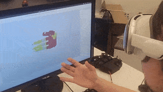

# Bidex/LEAP Hand VisionPro Teleop
This is based off of [VisionProTeleop](https://github.com/Improbable-AI/VisionProTeleop) by Younghyo Park et. al. which streams the Apple Vision Pro data over the network to a Python script.

We then run inverse kinematics using Pybullet and output LEAP Hand joint angles.
Feed these joint angles into your preferred [LEAP Hand API](https://github.com/leap-hand/LEAP_Hand_API) to control the real hand.  We support Python, ROS1/ROS2 etc.

This code was used as our teleop baseline in [Bimanual Dexterity for Complex Tasks](https://bidex-teleop.github.io/).



## Setup
Please follow [VisionProTeleop](https://github.com/Improbable-AI/VisionProTeleop) to setup the Vision Pro.

Then, clone this repo on an Ubuntu machine w/ Python connected to the same network as the Apple Vision Pro.
```
git clone https://github.com/leap-hand/Bidex_VisionPro_Teleop

pip install avp_stream numpy pybullet 
```

## How to Use
First wear the VisionPro and launch the VisionPro app, copy the IP address into AVP_IP in `avp_leap.py`  Now run our code:
```
python avp_leap.py
```
You should see a LEAP Right Hand appear in the Pybullet simulation and it should be controllable with your hand.  If Pybullet doesn't appear and it errors, the VisionPro may not be found on the network or setup correctly.

If you would like to use the left hand, change the paramter of `isLeft = True`

To control a real LEAP Hand, send the 16 joint angles to your favorite API, Python, ROS1 or ROS2.  The ordering and scaling is exactly the same.

## Extensions and Licensing
- If you find issues/bugs please feel free to open a Github Issue.
- Our tools are released under the MIT license, see LICENSE.md for details.

## Citing
This specific code was a joint effort led by Jiahui Yang, Haoyu Xiong and Kenneth Shaw.  If you find this codebase or [LEAP Hand](https://leaphand.com/) useful in your research, please cite:
```
@inproceedings{shaw2024bimanual,
    title={Bimanual Dexterity for Complex Tasks},
    author={Shaw, Kenneth and Li, Yulong and Yang, Jiahui and Srirama, Mohan Kumar and Liu, Ray and Xiong, Haoyu and Mendonca, Russell and Pathak, Deepak},
    booktitle={8th Annual Conference on Robot Learning},
    year={2024}
}

@article{shaw2023leaphand,
	title={LEAP Hand: Low-Cost, Efficient, and Anthropomorphic Hand for Robot Learning},
	author={Shaw, Kenneth and Agarwal, Ananye and Pathak, Deepak},
	journal={Robotics: Science and Systems (RSS)},
	year={2023}
}
```

Code is inspired by [Dexcap](https://dex-cap.github.io/) by Wang et. al. and [Robotic Telekinesis](https://robotic-telekinesis.github.io/) by Shaw et. al.
